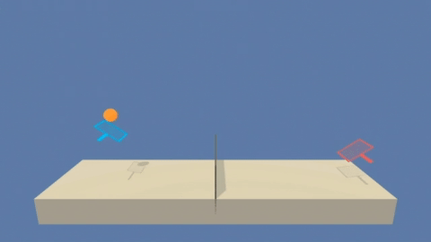

# Deep Reinforcement Learning : Collaboration - Competition

This project repository contains my work for the Udacity's [Deep Reinforcement Learning Nanodegree](https://www.udacity.com/course/deep-reinforcement-learning-nanodegree--nd893) Project 3: Collaboration - Competition.

### The goal of this project

In this project, the goal is to train two agents control rackets to bounce a ball over a net.



### Enviroment 

In this environment, two agents control rackets to bounce a ball over a net. If an agent hits the ball over the net, it receives a reward of +0.1. If an agent lets a ball hit the ground or hits the ball out of bounds, it receives a reward of -0.01. Thus, the goal of each agent is to keep the ball in play.

The observation space consists of 8 variables corresponding to the position and velocity of the ball and racket. Each agent receives its own, local observation. Two continuous actions are available, corresponding to movement toward (or away from) the net, and jumping.

The task is episodic, and in order to solve the environment, your agents must get an average score of +0.5 (over 100 consecutive episodes, after taking the maximum over both agents). Specifically,

- After each episode, we add up the rewards that each agent received (without discounting), to get a score for each agent. This yields 2 (potentially different) scores. We then take the maximum of these 2 scores.
- This yields a single score for each episode.

The environment is considered solved, when the average (over 100 episodes) of those scores is at least +0.5.

Please note that the project environment is similar to, but not identical to the Tennis environment on the Unity ML-Agents GitHub [page](https://github.com/Unity-Technologies/ml-agents/blob/master/docs/Learning-Environment-Examples.md).

More detailed description of the original Unity environment can be found in this [paper](https://arxiv.org/pdf/1809.02627.pdf).


### Getting Started

#### Setup the environment
1. Follow steps 1, 3 and 4 in the instructions [here](https://github.com/udacity/deep-reinforcement-learning#dependencies) to set up your Python environment. By following these instructions, you will install PyTorch, the ML-Agents toolkit, and a few more Python packages that are required for this project.

2. Clone this repository.
	
3. Download the environment from one of the links below.  You need only select the environment that matches your operating system:

 	- Linux: [click here](https://s3-us-west-1.amazonaws.com/udacity-drlnd/P3/Tennis/Tennis_Linux.zip)
 	- Mac OSX: [click here](https://s3-us-west-1.amazonaws.com/udacity-drlnd/P3/Tennis/Tennis.app.zip)
 	- Windows (64-bit): [click here](https://s3-us-west-1.amazonaws.com/udacity-drlnd/P3/Tennis/Tennis_Windows_x86.zip)
 	- Windows (32-bit): [click here](https://s3-us-west-1.amazonaws.com/udacity-drlnd/P3/Tennis/Tennis_Windows_x86_64.zip)
 	
 	    (_For Windows users_) Check out [this link](https://support.microsoft.com/en-us/help/827218/how-to-determine-whether-a-computer-is-running-a-32-bit-version-or-64) if you need help with determining if your computer is running a 32-bit version or 64-bit version of the Windows operating system.

    (_For AWS_) If you'd like to train the agent on AWS (and have not [enabled a virtual screen](https://github.com/Unity-Technologies/ml-agents/blob/master/docs/Training-on-Amazon-Web-Service.md)), then please use [this link](https://s3-us-west-1.amazonaws.com/udacity-drlnd/P2/Reacher/one_agent/Reacher_Linux_NoVis.zip) (version 1) or [this link](https://s3-us-west-1.amazonaws.com/udacity-drlnd/P2/Reacher/Reacher_Linux_NoVis.zip) (version 2) to obtain the "headless" version of the environment.  You will **not** be able to watch the agent without enabling a virtual screen, but you will be able to train the agent.  (_To watch the agent, you should follow the instructions to [enable a virtual screen](https://github.com/Unity-Technologies/ml-agents/blob/master/docs/Training-on-Amazon-Web-Service.md), and then download the environment for the **Linux** operating system above._)
    
    
  4. Place the file in the root folder of this repository, and unzip (or decompress) the file. 
  
  5. Open the Jupyter Notebook using the following command from the `Collaboration-Competition-Project` folder.
	```bash
	jupyter notebook
	```
  
  6. Change the kernel to match the `drlnd` environment by using the drop-down `Kernel` menu. 

#### Usage   
Follow the instructions in `Tennis.ipynb` to train the agent.
    
Please note that the code has been tested in Linux enviroment Ubuntu 18.04 LTS.
