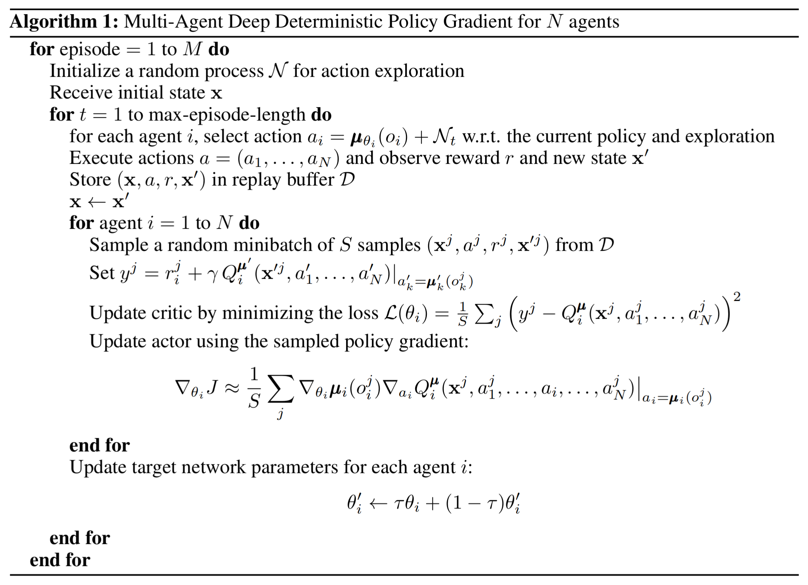
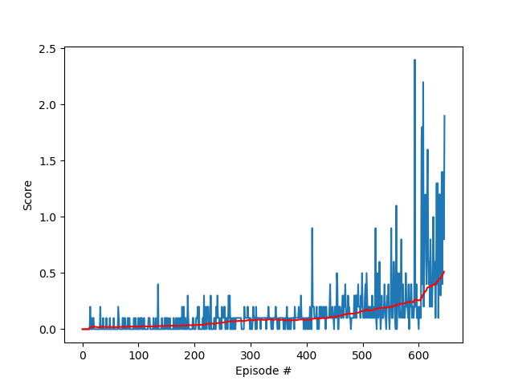

# 
  Report 

## Solution

#### Method 

The agents will be trained using a  Multi-Agent Deep Deterministic Policy Gradients (MADDPQ) algorithm which has been described in this [paper](https://arxiv.org/pdf/1706.02275.pdf) .

The (MADDPQ) algorithm is an extension of the Deep Deterministic Policy Gradients (DDPQ) algorithm which has been described in this [paper](https://arxiv.org/pdf/1509.02971.pdf) .

*MADDPG Algorithm pseudocode*

#### Hyperparameters

Values for the hyperparameters were obtained from the original paper and reference implementations 
and then tweaked based on the results of multiple runs.

| Hyperparameter | Value | Description |
|---|---:|---|
| BUFFER_SIZE | 1e6 | Maximum size of experience replay buffer |
| BATCH_SIZE | 128 | Number of experiences sampled in one batch |
| LR_ACTOR | 3e-4 | Controls parameters update of the online actor model |
| LR_CRITIC | 3e-4 | Controls parameters update of the online critic model |
| WEIGHT_DECAY | 0 | L2 weight decay |
| LEARN_EVERY | 5 | Learning timestep interval |
| LEARN_NUM | 5 | Number of learning passes |
| GAMMA | 0.99 | Discount rate for future rewards |
| TAU | 7e-2  | Controls soft update of target parameters |
| OU_SIGMA | 0.2 | Ornstein-Uhlenbeck noise parameter, volatility |
| OU_THETA | 0.12 | Ornstein-Uhlenbeck noise parameter, speed of mean reversion |
| EPS_START | 5.5 | Initial value for epsilon in noise decay process in Agent.act() |
| EPS_EP_END | 250 | Episode to end the noise decay process |
| EPS_FINAL | 0 | final Value for epsilon after decay |
| n_episodes | 2000 | Maximum number of episodes to train |
| max_t=1000 | 1000 | Maximum number of timesteps per episode |

#### Artificial neural network architecture
##### Actor
| Layer | Value | Description |
|---|---:|---|
| fc1_units, fc2_units | 256, 128 | Number of units in hidden layers of the actor model |
| BatchNorm1d |  | Batch normalization for input and hidden layers |
| leaky_relu |  | Leaky ReLU activation function |

##### Critic
| Layer | Value | Description |
|---|---:|---|
| fcs1_units, fcs2_units | 256, 128 | Number of units in hidden layers of the critic model |
| leaky_relu |  | Leaky ReLU activation function |

#### Results

Episodes 0000-0100	 Highest Reward: 0.200	 Lowest Reward: 0.000	 Average Score: 0.023
Episodes 0100-0200	 Highest Reward: 0.400	 Lowest Reward: 0.000	 Average Score: 0.036
Episodes 0200-0300	 Highest Reward: 0.300	 Lowest Reward: 0.000	 Average Score: 0.081
Episodes 0300-0400	 Highest Reward: 0.300	 Lowest Reward: 0.000	 Average Score: 0.084
Episodes 0400-0500	 Highest Reward: 0.900	 Lowest Reward: 0.000	 Average Score: 0.161
Episodes 0500-0600	 Highest Reward: 2.400	 Lowest Reward: 0.000	 Average Score: 0.256

Environment solved in 546 episodes!
Average Score: 0.512 over past 100 episodes
Training time = 292.62700 sec

*Results Graph*

## Future Work

##### More systematic way of searching of optimal values for hyperparameters:
 
 - Grid Search
 - Random Search
 - Bayesian Optimization
 - Genetic Algorithm

##### Experiment with other algorithms:
 - [Trust Region Policy Optimization (DDPG) (for each agent seperatly)](https://arxiv.org/pdf/1509.02971.pdf)
 - [Soft Actor-Critic Algorithms (SAC)](https://arxiv.org/abs/1812.05905)
 - [Trust Region Policy Optimization (TRPO)](https://arxiv.org/abs/1502.05477)
 - [Proximal Policy Optimization (PPO)](https://arxiv.org/pdf/1707.06347.pdf)
 - [Distributed Distributional Deterministic Policy Gradients (D4PG)](https://arxiv.org/abs/1804.08617)
 
